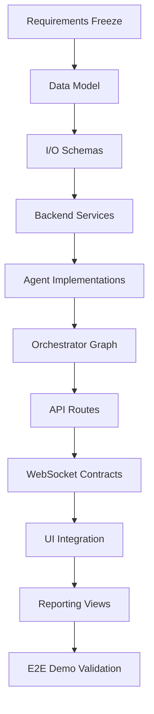

# DEPENDENCIES

## Dependency Rule
No phase starts until all upstream dependencies are complete and validated.

## Phase/Feature Dependency Graph

## Ordered Dependencies By Layer
1. Requirements and in-scope definitions
2. Data model and persistence schema
3. Shared schema contracts
4. Service layer behavior
5. Agent logic modules
6. Graph orchestration and gate handling
7. REST and WebSocket route integration
8. UI state and event rendering
9. End-to-end testing and demo checklist

## Feature Dependency Map
- Authenticated campaign creation depends on: users/campaigns model -> auth services -> auth/campaign routes -> UI forms.
- Agent execution depends on: campaign run schema -> agent I/O schemas -> agent modules -> orchestrator transitions.
- Approval gates depend on: approvals model -> gate service -> approval route -> realtime event broadcast -> UI action.
- Reporting depends on: completed run state -> reporter output schema -> report route -> report UI.

## Critical Path
Requirements -> Models -> Schemas -> Services -> Agents -> Graph -> Routes -> UI -> Demo.
