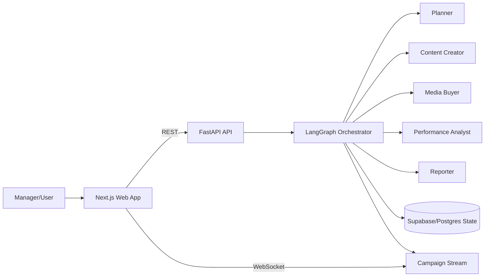

# MVP Preview And Manager Demo Guide (End-to-End)

## 1. Purpose Of This Document
This document is your single script to demonstrate the Autonomous Campaign Manager from basic to advanced level.

You can use it for:
- 5-minute executive demo
- 15-20 minute full product + technical walkthrough
- Q&A defense (architecture, reliability, quality, and scope)

The walkthrough is aligned to frozen in-scope requirements:
- Auth and campaign creation flow
- Multi-agent orchestration (planner, content creator, media buyer, performance analyst, reporter)
- Human approval checkpoints
- Real-time WebSocket updates
- Supabase-backed state persistence and retrieval
- Report output (JSON, Markdown, PDF placeholder)

## 2. What To Say In 30 Seconds
"This platform allows a marketing manager to create a campaign from one structured goal, then autonomous specialist agents execute planning, content, media allocation, performance analysis, and final reporting. Human approvals are enforced at key checkpoints, and the UI receives live campaign events over WebSocket. The entire journey is auditable, test-covered, and reproducible end-to-end."

## 3. Demo Environment Checklist

### Prerequisites
- Node.js 20+
- pnpm 9+
- Python 3.11+

### Services To Start
Terminal 1 (API):

```powershell
cd backend/apps/api
.\.venv\Scripts\Activate.ps1
python main.py
```

Terminal 2 (Web):

```powershell
cd frontend/apps/web
pnpm dev
```

### URLs To Keep Open
- Frontend: http://localhost:3000
- API docs: http://localhost:8000/docs
- Health: http://localhost:8000/health

### Environment Variables To Verify
Backend .env:
- SUPABASE_URL
- SUPABASE_ANON_KEY
- SUPABASE_SERVICE_ROLE_KEY
- API_SECRET_KEY
- FRONTEND_URL

Frontend .env.local:
- NEXT_PUBLIC_SUPABASE_URL
- NEXT_PUBLIC_SUPABASE_ANON_KEY
- NEXT_PUBLIC_API_URL=http://localhost:8000

## 4. Architecture Story (Manager-Friendly)
Use this as the system narrative:

1. User interacts with Next.js frontend.
2. Frontend calls FastAPI endpoints.
3. Backend starts workflow orchestration.
4. Orchestrator runs specialist agents in sequence with supervisor control.
5. Workflow pauses at approval gates when required.
6. Events are streamed to UI via WebSocket for live status.
7. Campaign state and outputs are persisted and retrievable.

Quick diagram for presentation:



## 5. End-To-End Flows (Basic To Advanced)

### Flow 1: Authentication (Basic)
Goal: prove secure access and identity context.

Demo steps:
1. Open Register page and create user.
2. Log in using email/password.
3. Show authenticated landing/workspace.

Manager callout:
- API supports register/login/me/refresh/logout + recovery endpoints.
- Campaign routes require valid bearer token.
- Organization/role checks are enforced in backend dependencies.

### Flow 2: Create Campaign (Basic)
Goal: show business goal to executable campaign transition.

Demo steps:
1. Go to New Campaign wizard.
2. Fill goal, industry, product, budget, timeline.
3. Submit campaign.
4. App navigates to campaign detail page.

What happens technically:
- POST /api/v1/campaigns creates record.
- Workflow starts automatically in background.
- Initial status is queued/running with progress tracking.

Manager callout:
- No manual DB step is required.
- This satisfies the "create + start orchestration" success criterion.

### Flow 3: Live Workflow Progress (Core)
Goal: demonstrate autonomous execution visibility.

Demo steps:
1. Open campaign detail page.
2. Show progress bar, current agent, estimated completion.
3. Show live activity timeline updating.

WebSocket event examples to mention:
- connected
- agent_started
- agent_completed
- human_approval_required
- optimization_alert
- campaign_completed
- error

Manager callout:
- UI is not waiting for manual refresh only; it streams lifecycle events.
- Heartbeat/ping-pong and reconnect behavior are implemented.

### Flow 4: Human Approval Gate - Strategy (Core)
Goal: prove human-in-the-loop safety.

Demo steps:
1. Wait until campaign status indicates strategy approval required.
2. Open approval modal.
3. Approve with feedback.
4. Show workflow resuming.

API action:
- POST /api/v1/campaigns/{campaign_id}/approve
	- approval_type=strategy
	- approved=true/false
	- feedback=string

Manager callout:
- Workflow can pause and resume at gate boundaries.
- This is an explicit control point, not a hidden automation decision.

### Flow 5: Human Approval Gate - Media Plan/Budget (Core)
Goal: validate second gate before downstream completion.

Demo steps:
1. Repeat approval flow when media plan gate appears.
2. Approve to continue into performance and reporting.

Important detail:
- Current implementation uses approval_type values: strategy and media_plan.

### Flow 6: Output Tabs (Core)
Goal: show each agent output is stored and visible.

Demo steps:
1. Strategy tab/page: show strategic objectives and channel direction.
2. Content tab/page: show generated assets.
3. Performance tab/page: show metrics/anomalies.
4. Report tab/page: final output.

Manager callout:
- This proves traceability from planning through reporting.

### Flow 7: Final Report + Export (Core)
Goal: prove stakeholder-ready output formats.

Demo steps:
1. Open report page.
2. Switch or download formats.
3. Demonstrate share action.

Report endpoint:
- GET /api/v1/campaigns/{campaign_id}/report?format=json|markdown|pdf

Behavior detail:
- If report is not ready, API returns 409 and triggers generation.
- PDF currently supports placeholder/base64 fallback if binary export is unavailable.

### Flow 8: Optimization Cycle (Advanced)
Goal: show post-launch optimization trigger.

Demo steps:
1. Trigger optimize action from UI/API.
2. Show workflow status moving back to running.
3. Observe optimization alert event and updated performance/report.

Endpoint:
- POST /api/v1/campaigns/{campaign_id}/optimize

Manager callout:
- Platform supports iterative optimization cycles, not just one-off generation.

### Flow 9: Failure/Recovery Narrative (Advanced)
Goal: show reliability plan and observability.

What to explain:
1. Agent errors are captured in campaign state and surfaced in UI.
2. WebSocket emits error events with retry_count metadata.
3. Supervisor/orchestrator includes retry and escalation logic.
4. Progress/status are consistently persisted and queryable.

Manager callout:
- Failures are visible and actionable, not silent.

### Flow 10: API-First Validation (Advanced)
Goal: prove contracts are inspectable and testable.

Demo steps:
1. Open /docs in browser.
2. Show auth endpoints.
3. Show campaign endpoints.
4. Highlight approve/report/optimize/status routes.

Manager callout:
- Frontend and backend follow explicit API contracts with validation.

## 6. Suggested Live Demo Script (15-20 Minutes)

### Minute 0-2: Context + Value
1. State problem: fragmented marketing execution.
2. Position solution: autonomous specialists + human governance + realtime visibility.

### Minute 2-5: Login + Dashboard
1. Login/register.
2. Show dashboard buckets: active/completed/pending approval.
3. Open campaign list and existing items.

### Minute 5-9: Create Campaign
1. Create campaign through wizard.
2. Submit and land on campaign detail.
3. Explain immediate workflow kickoff.

### Minute 9-13: Realtime + Approvals
1. Show timeline and websocket status.
2. Perform strategy approval.
3. Perform media plan approval.

### Minute 13-16: Outputs + Report
1. Show strategy/content/performance/report outputs.
2. Download JSON/Markdown/PDF.

### Minute 16-18: Advanced Controls
1. Trigger optimize endpoint/flow.
2. Show optimization alert and updated status.

### Minute 18-20: Quality + Close
1. Mention automated tests (backend, agents, frontend, e2e).
2. Mention frozen scope and non-goals.
3. Summarize why this is demo-ready and scalable.

## 7. 5-Minute Executive Version
If your manager has limited time, do only this:

1. Login and open dashboard.
2. Open one running campaign.
3. Show live progress + approval required.
4. Approve and show workflow continuation.
5. Open final report and download markdown.
6. Close with architecture one-liner: "specialist agents + approvals + realtime + persisted state."

## 8. Quality Evidence You Can Show

### Backend/API
- Auth flow tests
- Campaign endpoint tests
- WebSocket connection + contract tests

### Agents/Orchestration
- Orchestrator happy path completion test
- Confidence/retry behavior tests
- Agent-specific unit tests

### Frontend/E2E
- Campaign creation flow
- Human approval flow
- Realtime event handling flow
- Report rendering and action flow

Suggested commands:

```bash
pnpm test:backend
pnpm test:frontend
pnpm test:e2e
```

## 9. What Is In Scope Vs Not In Scope

### In Scope For This Demo
- End-to-end campaign workflow with 5 agents
- Human approvals and workflow resume
- Realtime event stream
- Report generation and viewing

### Explicit Non-Goals (Do Not Overpromise)
- Live ad-platform publishing integrations
- Enterprise multi-tenant administration depth
- Full MLOps retraining loops
- Native mobile applications
- Complete BI warehouse/dashboarding

## 10. Manager Q&A Cheat Sheet

Q: "How do we control AI decisions?"
A: Two explicit human approval checkpoints (strategy and media plan) pause and gate progression.

Q: "How do we know what happened in a run?"
A: Campaign state + event trail + timeline + report outputs provide full traceability.

Q: "What if an agent fails?"
A: Error is persisted, surfaced in UI, and emitted over WebSocket with retry metadata.

Q: "Is this just a mock?"
A: Core workflow, approvals, APIs, websocket, and tests are implemented; external ad-network integrations remain intentionally out-of-scope for MVP.

Q: "Can we scale this?"
A: API is structured for stateless scaling, orchestration logic is modular, and contracts are explicit for extension.

## 11. Key Endpoints Reference For Demo

Auth:
- POST /api/v1/auth/register
- POST /api/v1/auth/login
- GET /api/v1/auth/me
- POST /api/v1/auth/refresh
- POST /api/v1/auth/logout
- POST /api/v1/auth/password/forgot
- POST /api/v1/auth/password/reset

Campaigns:
- POST /api/v1/campaigns
- GET /api/v1/campaigns
- GET /api/v1/campaigns/{campaign_id}
- GET /api/v1/campaigns/{campaign_id}/status
- POST /api/v1/campaigns/{campaign_id}/approve
- GET /api/v1/campaigns/{campaign_id}/content
- GET /api/v1/campaigns/{campaign_id}/performance
- GET /api/v1/campaigns/{campaign_id}/report
- POST /api/v1/campaigns/{campaign_id}/optimize

Realtime:
- WS /ws/campaigns/{campaign_id}?token=<jwt>

Health:
- GET /health

## 12. Final Closing Statement For Manager
"This MVP demonstrates a complete campaign lifecycle with autonomous specialist agents, explicit human governance, real-time transparency, and test-backed reliability. We intentionally prioritized one robust end-to-end flow over broad but shallow integrations, which gives us a stable foundation to expand confidently in the next phase."
