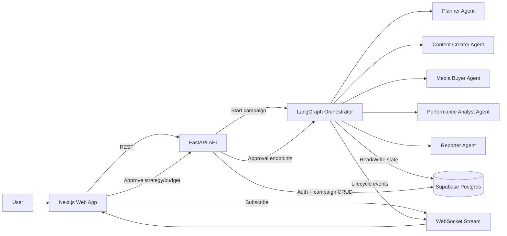
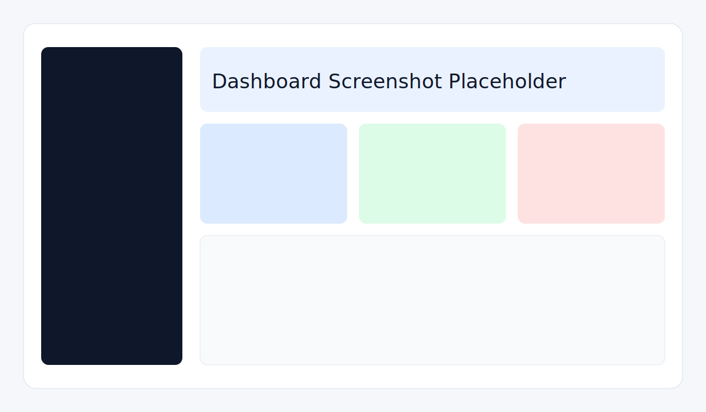
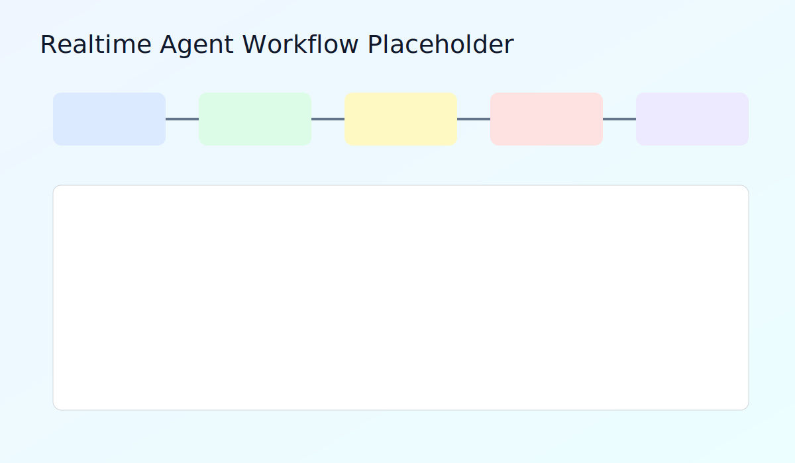
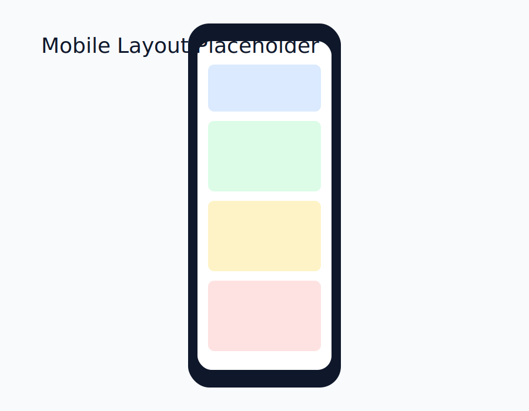

# Autonomous Campaign Manager

Autonomous Campaign Manager is an AI-first marketing workflow platform where specialized agents plan, generate, optimize, and report campaigns with explicit human approvals and real-time status updates.

## Current Phase Status

- Phase: planning artifacts complete, implementation scope frozen for 2-week demo.
- Requirements baseline: see REQUIREMENTS.md (frozen rule applies).
- Delivery readiness tracking: see DELIVERABLES.md and CHECKPOINTS.md.

## AI-First Development Approach

This repository follows a specification-driven workflow:
1. Freeze requirements first.
2. Lock schemas/contracts before feature coding.
3. Implement in dependency order (models -> schemas -> services -> agents -> graph -> routes -> UI).
4. Use checkpoint gates; no phase progression on non-green status.

## Documentation Index

### Project Planning & Requirements
- [REQUIREMENTS.md](REQUIREMENTS.md) - In-scope features and constraints (frozen)
- [SPEC.md](SPEC.md) - Detailed specifications and contracts
- [PLAN.md](PLAN.md) - 2-week delivery milestones
- [DEPENDENCIES.md](DEPENDENCIES.md) - Feature and layer dependencies
- [CHECKPOINTS.md](CHECKPOINTS.md) - Phase gates and validation criteria
- [DELIVERABLES.md](DELIVERABLES.md) - Final delivery checklist
- [FUTURE_VISION.md](FUTURE_VISION.md) - Post-MVP roadmap
- [MVP_PREVIEW.md](MVP_PREVIEW.md) - Demo outcomes and user-visible results

### Getting Started
- [DEVELOPMENT.md](DEVELOPMENT.md) - Step-by-step development setup
- [SYSTEM_SETUP.md](SYSTEM_SETUP.md) - Quick running guide
- [CONTRIBUTING.md](CONTRIBUTING.md) - Code standards and PR process
- [TROUBLESHOOTING.md](TROUBLESHOOTING.md) - Common issues and solutions

### Technical Architecture
- [ARCHITECTURE.md](ARCHITECTURE.md) - System design and component interactions
- [API.md](API.md) - REST API endpoints and contracts
- [DATABASE.md](DATABASE.md) - Data model and schema
- [AGENTS.md](AGENTS.md) - AI agent specifications and implementations
- [WEBSOCKET.md](WEBSOCKET.md) - Real-time event streaming
- [docs/architecture.mmd](docs/architecture.mmd) - Mermaid diagram

### Security & Operations
- [SECURITY.md](SECURITY.md) - Security guidelines and best practices
- [DEPLOYMENT.md](DEPLOYMENT.md) - Production deployment guide
- [TESTING.md](TESTING.md) - Testing strategy and guidelines
- [.github/copilot-instructions.md](.github/copilot-instructions.md) - Copilot guardrails
- [PROMPT_SEQUENCES.md](PROMPT_SEQUENCES.md) - Reusable Agent Mode prompts

## Architecture

Canonical Mermaid source: docs/architecture.mmd



## Repository Layout

```text
autonomous-campaign-manager/
	apps/
		api/                      FastAPI backend, auth, campaign routes, websocket route support
		web/                      Next.js frontend, campaign UI, realtime views, report screens
	packages/
		agents/                   Agent implementations + orchestrator logic
		database/                 Supabase migrations and typed database access layer
		types/                    Shared TypeScript domain contracts
	e2e/                        Playwright end-to-end specs
	docs/                       Architecture and demo-support artifacts
	.github/                    CI workflows and Copilot guardrails
```

## In-Scope Demo Flow (2 Weeks)

1. User registers or logs in.
2. User creates a campaign from a business goal.
3. Orchestrator runs planner, content, media, performance, and reporter agents.
4. Workflow pauses for strategy and budget approvals.
5. UI receives realtime events and displays progress.
6. User views final report output (JSON/Markdown).

## Quick Start

Prerequisites:
- Node.js 20+
- pnpm 9+
- Python 3.11+

Install dependencies:

```bash
pnpm install
```

Set up Python API environment:

```bash
cd apps/api
python -m venv .venv
.venv\Scripts\activate
pip install -e ".[dev]"
```

Set up Python agents environment:

```bash
cd ../../packages/agents
python -m venv .venv
.venv\Scripts\activate
pip install -e ".[dev]"
```

Configure environment files:

```bash
copy .env.example .env
copy backend\apps\api\.env.example backend\apps\api\.env
copy frontend\apps\web\.env.local.example frontend\apps\web\.env.local
copy backend\packages\agents\.env.example backend\packages\agents\.env
```

Start development:

```bash
pnpm dev
```

## Validation Commands

```bash
# Code quality
pnpm lint        # Run ESLint
pnpm type-check  # Full TypeScript check
pnpm format      # Auto-format with Prettier

# Testing
pnpm test                           # All tests
pnpm test:backend                   # Backend tests
pnpm test:frontend                  # Frontend tests
pnpm test:e2e                       # E2E tests
pnpm --filter @acm/web test:coverage  # Coverage report

# Individual test suites
cd backend/apps/api && python -m pytest          # API tests
cd ../../packages/agents && python -m pytest     # Agent tests
```

## Common Tasks

### Create a Feature
1. Create feature branch: `git checkout -b feature/my-feature`
2. Implement changes (follow DEVELOPMENT.md)
3. Run tests: `pnpm test`
4. Commit: `git commit -m "feat: describe change"`
5. Open PR and request review

### Debug Issues
- See [TROUBLESHOOTING.md](TROUBLESHOOTING.md) for common issues
- Check [SECURITY.md](SECURITY.md) for security concerns
- Use [TESTING.md](TESTING.md) for test failures

### Deploy to Production
- See [DEPLOYMENT.md](DEPLOYMENT.md) for deployment steps

## Demonstration Artifacts

For planning and demo governance, use:
- REQUIREMENTS.md
- FUTURE_VISION.md
- MVP_PREVIEW.md
- SPEC.md
- PLAN.md
- DEPENDENCIES.md
- PROMPT_SEQUENCES.md
- CHECKPOINTS.md
- DELIVERABLES.md

## Screenshots





## Notes

- Keep NEXT_PUBLIC_ENABLE_API_MOCKS=false for production-like runs.
- Treat REQUIREMENTS.md changes as a full re-planning trigger.
- Use CHECKPOINTS.md to enforce gate-driven phase progression.
